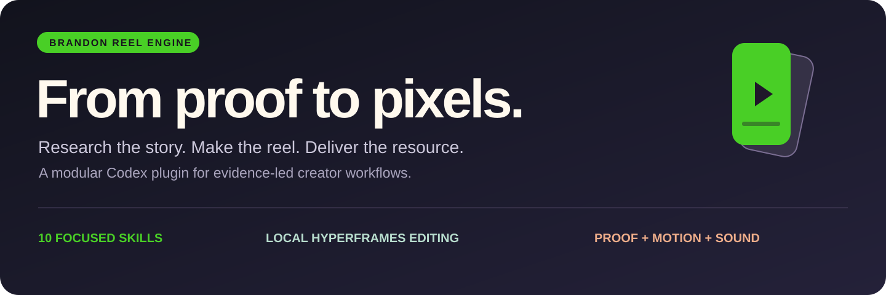
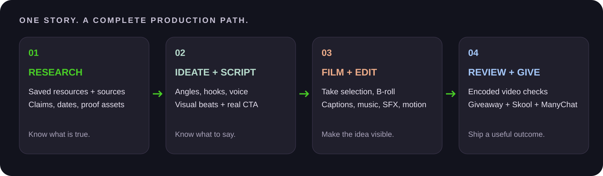

<p align="center"></p>

<p align="center">
  <strong>A research-to-reel production system for Codex.</strong><br>
  Your voice. Tight cuts. Animated edits. Useful giveaways.
</p>

<p align="center">
  <a href="#brandon-style-references">Style references</a> ·
  <a href="#get-started">Install</a> ·
  <a href="docs/capabilities.md">Capability guide</a> ·
  <a href="docs/workflow.md">Workflow</a> ·
  <a href="docs/integrations.md">Integrations</a>
</p>

Brandon Reel Engine turns a story into a complete creator workflow: develop an angle, write a filmable script, select useful visuals, edit the recorded take, review the actual output, and prepare the resource promised in the CTA. For a filmed reel, Brandon's spoken claims are accepted as given; editing never waits for a claim-accuracy or supporting-evidence check.

It combines **eleven focused skills** with a **local HyperFrames editing runtime**, practical source-finding recipes, reusable JSON contracts and explicit creative checks. Skills load by stage, so an agent can repair one weak visual or work through the complete pipeline.

**New link → ClickUp workflow:** [Copy a ready-to-use Codex prompt](docs/clickup-copy-paste.md) to create scripts, research notes, resource Docs and correctly staged cards using computer use. This workflow does not require the video-rendering dependencies.

## Brandon style references

The current visual target is based on Brandon's [Astra workflow](https://www.instagram.com/p/DdpOfqtgr8a/), [photographer website](https://www.instagram.com/p/DdsBCNtB6LW/) and [GovDeals](https://www.instagram.com/p/DdkZiwiuDPv/) reels. Read the [observed style profile](skill/references/brandon-style-profile.md). It separates short lower-third spoken captions from independent large green/white editorial graphics. An original-footage 20-second calibration and Brandon's review remain required before claiming a match.

See the [migration inventory and acceptance checklist](docs/brandon-migration.md) for the exact legacy mappings, build gates and verification status.

For local reference video files and a finished 20-second Brandon cut, use `python production/compare_style.py --candidate BRANDON.mp4 --reference Astra ASTRA.mp4 START END proof --reference Photographer PHOTOGRAPHER.mp4 START END website --reference GovDeals GOVDEALS.mp4 START END mechanism --out /absolute/review-directory`. Select intervals by the same visual job, then inspect the frame slider and listen to the originals. The tool records a pending review; it does not grade resemblance.

The [upstream Mobbin showcase](docs/showcase.md), the GIF below, and the [Director's Cut website](https://open-yoga-hpnv.here.now/?v=3) are historical Samin material retained with attribution, not a Brandon calibration.


## One connected pipeline



| Stage | What you get |
|---|---|
| **Research** | Primary-source claims, verified action states and useful screen-proof opportunities; resource stacks when the story calls for them. |
| **Ideation** | A specific hook, audience payoff, visual angle and a giveaway worth asking for. |
| **Scripting** | Multiple honest hook variants, a spoken mechanism, real proof opportunities and a precise face-to-camera keyword offer. |
| **Intake** | Word-timed transcription, take candidates, reviewed cuts and an editable source-to-output map. |
| **Assets** | Relevant posts, GitHub READMEs, docs, screenshots, screen recordings and real resource previews with provenance. |
| **Generation** | A bounded brief for missing explanatory images or motion, using an available provider; generated material stays distinguishable from evidence. |
| **Editing** | A-roll, full-screen evidence and optional split; independent spoken captions and animated green/white editorial graphics, sound and deterministic renders. |
| **Review** | Encoded-frame and audio review, both text tracks, animation, transitions, calibration comparison and timecoded repairs. |
| **Giveaways** | Real prompts, checklists or resource packs that match the spoken promise and CTA keyword. |
| **Delivery** | Skool post and ManyChat handoff packets, release files and a verifiable production record. Publication is a separate action. |

## What makes the edit different

- **Story drives the visuals.** Use supplied screen captures where useful and animated authored graphics for uncaptured steps. Do not fact-check Brandon's recorded claims or require proof as an editing gate.
- **Two text systems.** Short word-timed lower-third captions and larger animated green/white editorial graphics have separate timing, placement and meaning.
- **Cuts follow understanding.** A-roll, full-screen proof, illustrative footage and optional split are chosen by the claim; there is no fixed cut interval.
- **The CTA is direct.** Brandon faces the camera and says the exact displayed keyword.
- **Motion is required.** Animate every authored on-screen text/card/illustration and use purposeful transitions at appropriate boundaries, even when the assembly omits them. Never put disclaimers or production caveats on the video.
- **Style requires calibration.** Compare a 20-second render from original Brandon footage with the three references, then wait for his review before claiming a match.

## Get started

You need Codex with plugin support, Git, Python **3.11**, Node.js and FFmpeg/FFprobe. Provider accounts are only needed for the stages that use them.

```bash
git clone https://github.com/aibskool/short-form-editor.git
cd short-form-editor

python3.11 -m venv .venv
source .venv/bin/activate
python -m pip install -r production/requirements.txt
npm ci --prefix production/editor

python tools/build-plugin.py
python plugins/brandon-reel-engine/scripts/reel.py --project "$PWD" configure
codex plugin marketplace add "$PWD"
codex plugin add brandon-reel-engine@brandon-reel-engine
```

Start a new Codex task to load the installed skills. Keep the virtual environment active for CLI commands. The dependency pins capture the tested Python 3.11 setup; they are not a claim of universal platform compatibility.

For local speech transcription, also install `production/requirements-intake.txt` and supply or download the Whisper model required by the intake command. See [setup and first-run checks](docs/setup.md).

**Bring your own scripts and footage.** This public repository contains no private voice corpus, saved bookmarks, raw filming batches, account data or credentials. Add your own voice samples locally before requesting a voice match. The finished showcase is included as a demonstration, not as a raw asset library.

## Ask it to work

**Start from an idea**

> Use Brandon Reel Engine. Research the claim, draft two distinct truthful hooks, plan A-roll, actual screen proof, illustrative footage and green/white kinetic graphics. Script in my voice and build the exact keyword resource before promising it.

The [historical curated resource format](skill/references/curated-resource-reels.md) is optional. Current scripts follow the story and its proof. Use authorized saved resources and primary sources when available.

**Turn a filmed batch into a reel**

> Use reel director. Here are my footage, scripts and reference. Select the take, preserve my actual voice, find supporting real-world B-roll and make a vertical review cut with captions, animated graphics, transitions and SFX, without background music.

**Repair a weak edit**

> Use reel review. Inspect this export at phone size. Check the first frame, first-second motion, source relevance, caption placement, animation, transitions and SFX; confirm no music. Make timecoded repairs and recheck the output.

**Prepare the giveaway handoff**

> Prepare the actual resource, a matching Skool post and a ManyChat keyword packet. Validate the links and record what still needs configuration before publishing.

## Eleven skills, loaded as needed

| Skill | Focus |
|---|---|
| [`reel-director`](plugins/brandon-reel-engine/skills/reel-director/SKILL.md) | State, stage routing and the complete workflow |
| [`reel-research`](plugins/brandon-reel-engine/skills/reel-research/SKILL.md) | Sources, bookmarks, facts and visual leads |
| [`reel-ideation`](plugins/brandon-reel-engine/skills/reel-ideation/SKILL.md) | Hooks, angles, viewer value and giveaway promises |
| [`reel-script`](plugins/brandon-reel-engine/skills/reel-script/SKILL.md) | Your supplied voice examples and filmable copy |
| [`reel-intake`](plugins/brandon-reel-engine/skills/reel-intake/SKILL.md) | Transcription, take selection and timing |
| [`reel-assets`](plugins/brandon-reel-engine/skills/reel-assets/SKILL.md) | Real-source B-roll and visible proof |
| [`reel-generate`](plugins/brandon-reel-engine/skills/reel-generate/SKILL.md) | Explanatory asset generation and inspection |
| [`reel-edit`](plugins/brandon-reel-engine/skills/reel-edit/SKILL.md) | Composition, captions, motion, transitions and SFX |
| [`reel-review`](plugins/brandon-reel-engine/skills/reel-review/SKILL.md) | Actual-output judgment and repair |
| [`reel-deliver`](plugins/brandon-reel-engine/skills/reel-deliver/SKILL.md) | Resource packs, Skool and ManyChat handoffs |
| [`reel-clickup`](plugins/brandon-reel-engine/skills/reel-clickup/SKILL.md) | Complete ClickUp cards, resource Docs and verified board stages |

## Local tools underneath the skills

The runner exposes a fixed set of commands rather than arbitrary shell dispatch:

```bash
python plugins/brandon-reel-engine/scripts/reel.py doctor
python plugins/brandon-reel-engine/scripts/reel.py run pipeline -- --help
python plugins/brandon-reel-engine/scripts/reel.py run capture -- --help
python production/editor/edit.py build --help
python plugins/brandon-reel-engine/scripts/reel.py run check -- --help
```

Research collection, pipeline validation, script measurement, intake, take preparation, timing remaps, evidence capture, composition building, rendering, mastering, editorial checks, a review player and ManyChat packet preparation are included. [Browse the commands and their boundaries](docs/capabilities.md).

> **Integration boundary:** Eden, Drive, Heptabase, generation providers, Skool and project-management apps use the capabilities and authenticated accounts available to your agent. They are not bundled account connections. The included ManyChat adapter prepares packets and optionally reads metadata; it does **not** author flows or send subscriber messages. HyperFrames is the local renderer; a HeyGen account is not required for that route.

## Built for repeatable agent work

The playbooks contain ordered procedures, fallback options, concrete pass/fail examples and JSON review records. They are designed to reduce guesswork for less capable models. Creative judgment still needs checking: **no model-equivalence or retention guarantee is claimed**.

Useful starting points:

- [Operator runbook](plugins/brandon-reel-engine/references/operator-runbook.md)
- [Visual-evidence rules](plugins/brandon-reel-engine/references/visual-evidence.md)
- [Shot recipes and opening motion](plugins/brandon-reel-engine/references/shot-recipes.md)
- [Quality procedure](plugins/brandon-reel-engine/references/quality-procedure.md)
- [Creative-review template](plugins/brandon-reel-engine/templates/creative-review.json)
- [Asset-index schema](production/asset-index.schema.json) and [editorial-map schema](production/editorial-map.schema.json)

## Repository map

```text
plugins/brandon-reel-engine/   11 skills, shared playbooks, templates and runner
production/                 Local intake, capture, edit and review runtime
skill/                      Maintained playbooks and research/pipeline helpers
tools/hold-your-voice/       Voice-profile and draft-check helper
voice/                      Instructions for your local, ignored voice samples
docs/                       Setup, capabilities, workflow and visual showcase
```

This fork retains source-available upstream material. Council/Mobbin examples and the upstream public showcase are historical, not Brandon style samples. Raw Brandon filming and a reviewed calibration are not bundled.

Public/source-available, with rights retained unless separately licensed. See [LICENSE](LICENSE) and [third-party notices](THIRD_PARTY_NOTICES.md).
